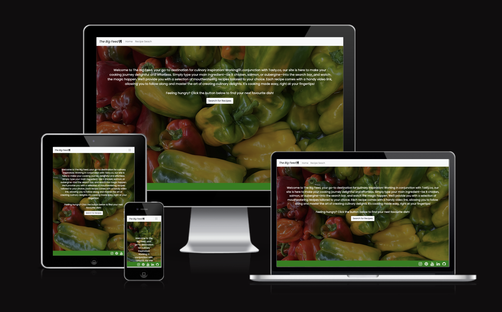
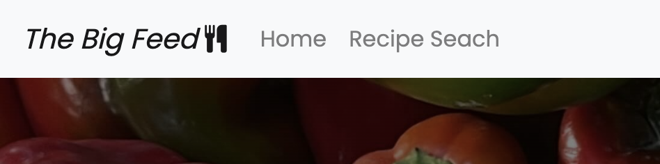
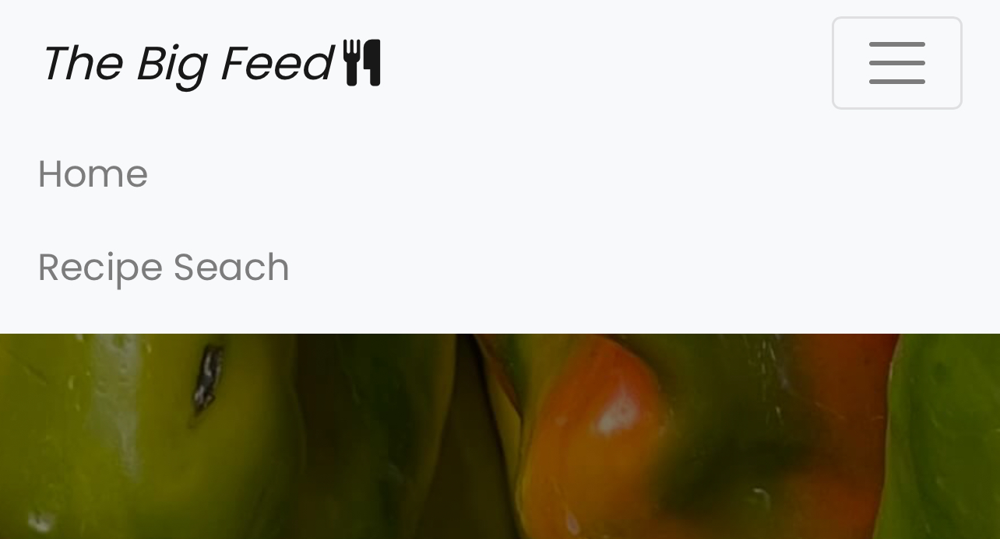
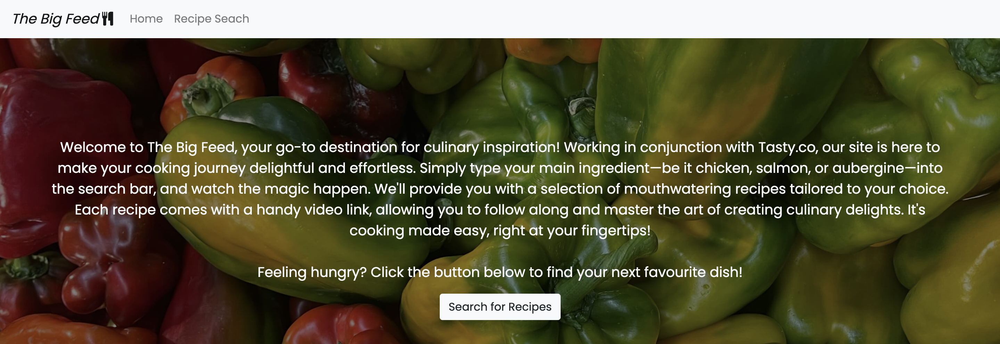
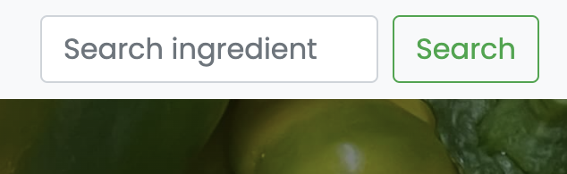
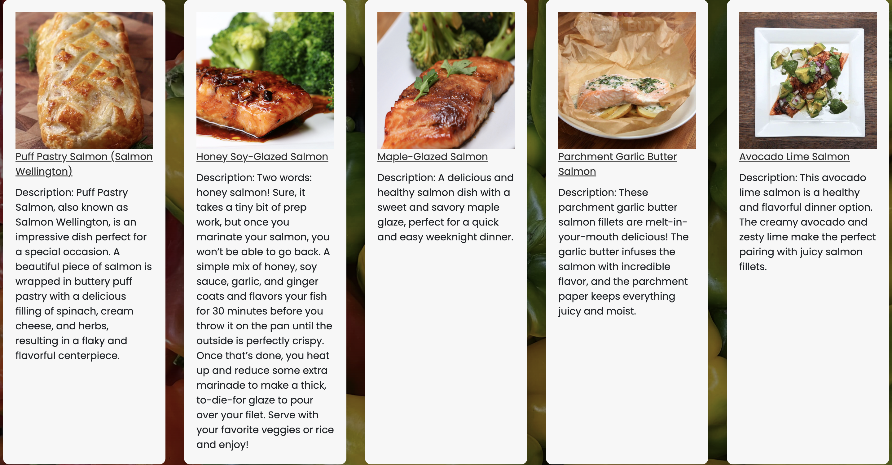

# The Big Feed

I’ve created a web-based application to help users discover recipes based on the ingredients they have to hand. You are able to view this [here](https://sian504.github.io/the-big-feed/).

## Business Goals

The business goals for the site are as follows:

- **Personalised Recipe Recommendations:** The application uses the Tasty API to retrieve recipes based on the ingredients the user inputs, aiming to offer a diverse range of recipes to suit tastes and dietary preferences.
- **Reduce Food Waste:** By suggesting recipes based on the user’s available ingredients, the application helps to make the most of what's leftover in the kitchen, while also promoting sustainability.
- **Enhance Cooking Creativity:** The application aims to encourage culinary exploration and creativity. The recipe suggestions aim to inspire users to try new dishes and cooking techniques, helping them expand their culinary repertoire.

---

## First-time User Stories

- As a first-time user, I want to be able to easily input the ingredients I have on hand, so the application can suggest recipes that I can make with those ingredients.
- As a first-time user, I want to see a step-by-step guide for the recommended recipes, including ingredients, cooking instructions, and estimated preparation time.
- As a first-time user, I want the application to suggest recipes based on the time I have available to cook, such as quick and easy recipes for busy weeknights or more elaborate dishes for special occasions.

## Returning User Stories

- As a returning user, now I know how the app fully works, I am able to use it on any device so that I can use the app while I am cooking.
- As a returning user, I want to access the site's social media links, so I can follow their updates on different platforms and share this with my friends.

---

## UX

I designed the site using the core principles of UX. I used this framework to think about my target users and what features would be present on the website.

## Strategy

**The Big Feed** is aimed at the following users:

- **Home Cooks:** The primary audience is likely to be individuals who enjoy cooking at home and are looking for convenient ways to plan meals and discover new recipes.
- **Food Enthusiasts:** People who have a passion for food, cooking, and trying out different cuisines may be interested in using the app to expand their culinary repertoire.
- **Busy Professionals and Families:** Those with busy schedules who need help with meal planning and utilising ingredients on hand efficiently. Families seeking to create diverse and satisfying meals may also find the app useful.
- **Health-Conscious Consumers:** Individuals who are mindful of their dietary preferences and restrictions, including vegetarians, vegans, gluten-free, or other dietary choices.
- **Sustainability Advocates:** People who are environmentally conscious and want to reduce food waste by using up ingredients they already have.

### These users would be looking for the following

- **User-Friendly Recipe Cards:** Each recipe should be presented in an easy-to-read format, including a list of ingredients, and clear step-by-step instructions.
- **Personalised Recommendations:** The website should offer personalised recipe recommendations based on user preferences and ingredients they have on hand. This feature keeps users engaged and encourages exploration.
- **Mobile Responsiveness:** The website should be optimised for mobile devices to ensure a seamless experience for users who access it from smartphones or tablets.

I want to keep the website simple as well as intuitive. I want the interface to be visually appealing as well as user-friendly in the best possible way so that the user is able to understand the purpose of the website straight away.

## Scope

To achieve the business goals and user requirements, I will be including the following features:

- Header and menu that allows users to navigate through all pages of the site
- A visually appealing landing page that explains the purpose of the site
- An easy to use search function that is intuitive and user friendly
- Visually appealing recipe cards that give all the information the user needs to know about the dish 
- Links to social media pages

## Structure

The website will consist of 2 pages:

1. Home page
2. Recipe search and results page

These pages will be contained in a navigation bar that will appear at the top of each page so that the user is able to navigate easily through all sections of the site. The order of the navigation bar appears in order of priority Home > Recipe search. I believe this is a natural progression for the user and a layout that they will expect from this kind of site.

The homepage will consist of a visually appealing image along with a short About section so that users are able to understand the purpose of the site. All text blocks will be minimal to not overwhelm the user but inform them of exactly what they can expect. The recipe search section will allow the user to search for recipes based on the ingredients that they have and will display the results provided by the Tasty API. These will be arranged into recipe cards that will display the name of the dish, an image and a description that will help users to decide whether they want to cook the recipe.

## Skeleton

I have linked the wireframes for each device below:

- [Desktop](assets/wireframes/desktop.png)
- [Tablet](assets/wireframes/tablet.png)
- [Mobile](assets/wireframes/mobile.png)

## Surface

The website will be presented with a background hero image throughout. I decided to use one of my own images that I had taken myself as the image itself is quite colourful and suitable for the site's purpose. The nav bar will be a contrasting white colour and the text contained will be dark/grey to contrast the navbar. 

The about paragraph text will be white to contrast the bright colours of the background image so this can be read clearly by the user.

I will be using Poppins for all the text on the site. By using this font, my website will have a simple but professional feel to it.

---

## Features 

The website was designed mobile-first as it is likely that users will be viewing this on their phone. There are 2 pages that are displayed in the order Homepage > Recipe Search. The colour theme is mostly white, green, red and yellow. All text has been given the font Poppins. The colour scheme and font have been used throughout for consistency.

- Header and menu that allows users to navigate through all pages of the site
- A visually appealing landing page that explains the purpose of the site
- An easy to use search function that is intuitive and user friendly
- Visually appealing recipe cards that give all the information the user needs to know about the dish 
- Links to social media pages

### Menu

### Desktop View

### Small Screen View

The header and menu items are positioned in the top left of the screen. It consists of 2 links on the desktop view of the landing page and the 2 links and the search bar on the recipe search page. This applies for small screen view but has been condensed into a hamburger menu.

I chose this menu for the smaller screens as the text for the menu items was displaying as small and could have been an issue for users when trying to navigate.

This satisfies the user story: As a first-time user, I want to be able to easily input the ingredients I have on hand, so the application can suggest recipes that I can make with those ingredients.

### Landing Page

The landing page is a very simple webpage that contains the nav bar, heading and an about section that explains the purpose of the website and how the user can utilise the features. Underneath the text is a call-to-action button that invites users to navigate to the search page where they can search for recipes. 

This also satisfies the user story: As a first-time user, I want to be able to easily input the ingredients I have on hand, so the application can suggest recipes that I can make with those ingredients.

### Search Function

The search function is a simple search field contained within the navbar that the user can input their ingredient. The custom Javascript file has an event listener added to this to call the Tasty API to return search results.

This also satisfies the user story: As a first-time user, I want to be able to easily input the ingredients I have on hand, so the application can suggest recipes that I can make with those ingredients.

### Recipe Cards

The recipe cards are the results of the API call from the Tasty API rendered in a simple text box complete with appealing image, recipe heading and description. The headings are hyperlinked and once clicked takes the user to a video that explains the ingredients and how to make the recipe. 

The results show a variety of recipes suitable for the time available and the dietary preferences of the user.

This satisfies the user stories: As a first-time user, I want to see a step-by-step guide for the recommended recipes, including ingredients, cooking instructions, and estimated preparation time.

and

As a first-time user, I want the application to suggest recipes based on the time I have available to cook, such as quick and easy recipes for busy weeknights or more elaborate dishes for special occasions.

### Social Links

In the footer of each webpage, I have added 5 Font Awesome icons linking users to Instagram, Pinterest, YouTube, LinkedIn and GitHub so that the user can learn more about the site and keep up to date with new content.

This satisfies the user story: As a returning user, I want to access the site's social media links, so I can follow their updates on different platforms and share this with my friends.

### Responsiveness

The site is fully responsive on desktop, mobile and tablet allowing users to utilise the website wherever they are no matter what their device. 

This satisfies the user story: As a returning user, I want to access the site's social media links, so I can follow their updates on different platforms and share this with my friends.

---

## What I used

To create this project I used the following:

- [HTML](https://www.w3schools.com/html/html_intro.asp) - The coding language used to create the structure of the website.
- [CSS](https://www.w3schools.com/css/css_intro.asp)  -The coding language used to style the site throughout.
- [Javascript](https://www.w3schools.com/js/js_intro.asp) - The coding language used for all the interactive components of the website. I used Bootstrap, JQuery and my own Javascript script within this project.
- [Tasty API](https://rapidapi.com/apidojo/api/tasty/) - The API used to access the recipes and video links suggested in the search results.
- [JQuery](https://jquery.com/) - The Javascript library used to write my script to call the Tasty API.
- [Google Fonts](https://fonts.google.com/) - Fonts for both the headers and the body text were taken from here. The font I used is Poppins.
- [Font Awesome](https://fontawesome.com/search) - Used for the header and social media icons in the footer.
- [Chrome Developer Tools](https://developer.chrome.com/docs/devtools/) - Used to test responsiveness across the site.
- [GitHub](https://github.com/) - Used as a storage space for my pushed code.
- [Git](https://git-scm.com/) - Used for version control to make commits and push to GitHub.
- [CodeAnywhere](https://app.codeanywhere.com/) - The cloud development environment I used to build the site.
- [Balsamiq](https://balsamiq.cloud/sidwtio/poonp92/rD331) - Used to create the wireframes.
- [W3C Markup Validation Service](https://validator.w3.org/) - Used to validate all HTML written for the site.
- [W3C CSS Validation Service](https://jigsaw.w3.org/css-validator/) - Validated all CSS code written for the site.
- [AmIResponsive](https://ui.dev/amiresponsive) - Used to create the responsive image you see at the top of the README file.

---