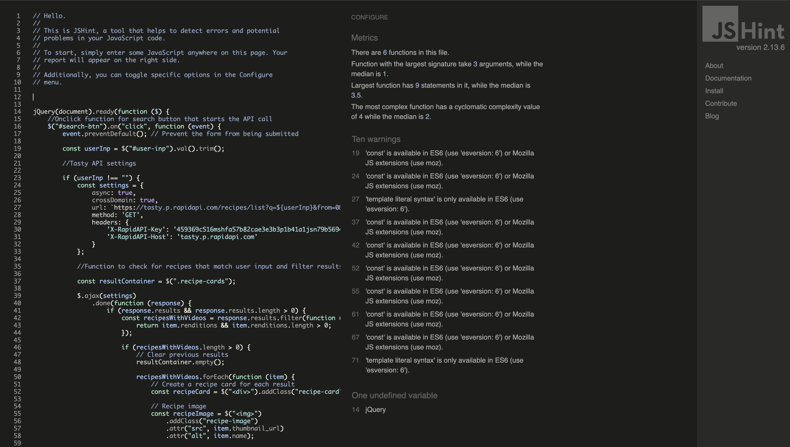

# The Big Feed

I’ve created a web-based application to help users discover recipes based on the ingredients they have to hand. You are able to view this [here](https://sian504.github.io/the-big-feed/).

## Business Goals

The business goals for the site are as follows:

- **Personalised Recipe Recommendations:** The application uses the Tasty API to retrieve recipes based on the ingredients the user inputs, aiming to offer a diverse range of recipes to suit tastes and dietary preferences.
- **Reduce Food Waste:** By suggesting recipes based on the user’s available ingredients, the application helps to make the most of what's leftover in the kitchen, while also promoting sustainability.
- **Enhance Cooking Creativity:** The application aims to encourage culinary exploration and creativity. The recipe suggestions aim to inspire users to try new dishes and cooking techniques, helping them expand their culinary repertoire.

---

## First-time User Stories

- As a first-time user, I want to be able to easily input the ingredients I have on hand, so the application can suggest recipes that I can make with those ingredients.
- As a first-time user, I want to see a step-by-step guide for the recommended recipes, including ingredients, cooking instructions, and estimated preparation time.
- As a first-time user, I want the application to suggest recipes based on the time I have available to cook, such as quick and easy recipes for busy weeknights or more elaborate dishes for special occasions.

## Returning User Stories

- As a returning user, now I know how the app fully works, I am able to use it on any device so that I can use the app while I am cooking.
- As a returning user, I want to access the site's social media links, so I can follow their updates on different platforms and share this with my friends.

---

## UX

I designed the site using the core principles of UX. I used this framework to think about my target users and what features would be present on the website.

## Strategy

**The Big Feed** is aimed at the following users:

- **Home Cooks:** The primary audience is likely to be individuals who enjoy cooking at home and are looking for convenient ways to plan meals and discover new recipes.
- **Food Enthusiasts:** People who have a passion for food, cooking, and trying out different cuisines may be interested in using the app to expand their culinary repertoire.
- **Busy Professionals and Families:** Those with busy schedules who need help with meal planning and utilising ingredients on hand efficiently. Families seeking to create diverse and satisfying meals may also find the app useful.
- **Health-Conscious Consumers:** Individuals who are mindful of their dietary preferences and restrictions, including vegetarians, vegans, gluten-free, or other dietary choices.
- **Sustainability Advocates:** People who are environmentally conscious and want to reduce food waste by using up ingredients they already have.

### These users would be looking for the following

- **User-Friendly Recipe Cards:** Each recipe should be presented in an easy-to-read format, including a list of ingredients, and clear step-by-step instructions.
- **Personalised Recommendations:** The website should offer personalised recipe recommendations based on user preferences and ingredients they have on hand. This feature keeps users engaged and encourages exploration.
- **Mobile Responsiveness:** The website should be optimised for mobile devices to ensure a seamless experience for users who access it from smartphones or tablets.

I want to keep the website simple as well as intuitive. I want the interface to be visually appealing as well as user-friendly in the best possible way so that the user is able to understand the purpose of the website straight away.

## Scope

To achieve the business goals and user requirements, I will be including the following features:

- Header and menu that allows users to navigate through all pages of the site
- A visually appealing landing page that explains the purpose of the site
- An easy to use search function that is intuitive and user friendly
- Visually appealing recipe cards that give all the information the user needs to know about the dish 
- Links to social media pages

## Structure

The website will consist of 2 pages:

1. Home page
2. Recipe search and results page

These pages will be contained in a navigation bar that will appear at the top of each page so that the user is able to navigate easily through all sections of the site. The order of the navigation bar appears in order of priority Home > Recipe search. I believe this is a natural progression for the user and a layout that they will expect from this kind of site.

The homepage will consist of a visually appealing image along with a short About section so that users are able to understand the purpose of the site. All text blocks will be minimal to not overwhelm the user but inform them of exactly what they can expect. The recipe search section will allow the user to search for recipes based on the ingredients that they have and will display the results provided by the Tasty API. These will be arranged into recipe cards that will display the name of the dish, an image and a description that will help users to decide whether they want to cook the recipe.

## Skeleton

I have linked the wireframes for each device below:

- [Desktop](assets/wireframes/desktop.png)
- [Tablet](assets/wireframes/tablet.png)
- [Mobile](assets/wireframes/mobile.png)

## Surface

The website will be presented with a background hero image throughout. I decided to use one of my own images that I had taken myself as the image itself is quite colourful and suitable for the site's purpose. The nav bar will be a contrasting white colour and the text contained will be dark/grey to contrast the navbar. 

The about paragraph text will be white to contrast the bright colours of the background image so this can be read clearly by the user.

I will be using Poppins for all the text on the site. By using this font, my website will have a simple but professional feel to it.

---

## Features 

The website was designed mobile-first as it is likely that users will be viewing this on their phone. There are 2 pages that are displayed in the order Homepage > Recipe Search. The colour theme is mostly white, green, red and yellow. All text has been given the font Poppins. The colour scheme and font have been used throughout for consistency.

- Header and menu that allows users to navigate through all pages of the site
- A visually appealing landing page that explains the purpose of the site
- An easy to use search function that is intuitive and user friendly
- Visually appealing recipe cards that give all the information the user needs to know about the dish 
- Links to social media pages

### Menu

### Desktop View

### Small Screen View

The header and menu items are positioned in the top left of the screen. It consists of 2 links on the desktop view of the landing page and the 2 links and the search bar on the recipe search page. This applies for small screen view but has been condensed into a hamburger menu.

I chose this menu for the smaller screens as the text for the menu items was displaying as small and could have been an issue for users when trying to navigate.

This satisfies the user story: As a first-time user, I want to be able to easily input the ingredients I have on hand, so the application can suggest recipes that I can make with those ingredients.

### Landing Page

The landing page is a very simple webpage that contains the nav bar, heading and an about section that explains the purpose of the website and how the user can utilise the features. Underneath the text is a call-to-action button that invites users to navigate to the search page where they can search for recipes. 

This also satisfies the user story: As a first-time user, I want to be able to easily input the ingredients I have on hand, so the application can suggest recipes that I can make with those ingredients.

### Search Function

The search function is a simple search field contained within the navbar that the user can input their ingredient. The custom Javascript file has an event listener added to this to call the Tasty API to return search results.

This also satisfies the user story: As a first-time user, I want to be able to easily input the ingredients I have on hand, so the application can suggest recipes that I can make with those ingredients.

### Recipe Cards

The recipe cards are the results of the API call from the Tasty API rendered in a simple text box complete with appealing image, recipe heading and description. The headings are hyperlinked and once clicked takes the user to a video that explains the ingredients and how to make the recipe. 

The results show a variety of recipes suitable for the time available and the dietary preferences of the user.

This satisfies the user stories: As a first-time user, I want to see a step-by-step guide for the recommended recipes, including ingredients, cooking instructions, and estimated preparation time.

and

As a first-time user, I want the application to suggest recipes based on the time I have available to cook, such as quick and easy recipes for busy weeknights or more elaborate dishes for special occasions.

### Social Links

In the footer of each webpage, I have added 5 Font Awesome icons linking users to Instagram, Pinterest, YouTube, LinkedIn and GitHub so that the user can learn more about the site and keep up to date with new content.

This satisfies the user story: As a returning user, I want to access the site's social media links, so I can follow their updates on different platforms and share this with my friends.

### Responsiveness

The site is fully responsive on desktop, mobile and tablet allowing users to utilise the website wherever they are no matter what their device. 

This satisfies the user story: As a returning user, I want to access the site's social media links, so I can follow their updates on different platforms and share this with my friends.

---

## What I Used

To create this project I used the following:

- [HTML](https://www.w3schools.com/html/html_intro.asp) - The coding language used to create the structure of the website.
- [CSS](https://www.w3schools.com/css/css_intro.asp)  -The coding language used to style the site throughout.
- [Javascript](https://www.w3schools.com/js/js_intro.asp) - The coding language used for all the interactive components of the website. I used Bootstrap, JQuery and my own Javascript script within this project.
- [Tasty API](https://rapidapi.com/apidojo/api/tasty/) - The API used to access the recipes and video links suggested in the search results.
- [JQuery](https://jquery.com/) - The Javascript library used to write my script to call the Tasty API.
- [Google Fonts](https://fonts.google.com/) - Fonts for both the headers and the body text were taken from here. The font I used is Poppins.
- [Font Awesome](https://fontawesome.com/search) - Used for the header and social media icons in the footer.
- [Chrome Developer Tools](https://developer.chrome.com/docs/devtools/) - Used to test responsiveness across the site.
- [GitHub](https://github.com/) - Used as a storage space for my pushed code.
- [Git](https://git-scm.com/) - Used for version control to make commits and push to GitHub.
- [CodeAnywhere](https://app.codeanywhere.com/) - The cloud development environment I used to build the site.
- [Balsamiq](https://balsamiq.cloud/sidwtio/poonp92/rD331) - Used to create the wireframes.
- [W3C Markup Validation Service](https://validator.w3.org/) - Used to validate all HTML written for the site.
- [W3C CSS Validation Service](https://jigsaw.w3.org/css-validator/) - Validated all CSS code written for the site.
- [JS Hint](https://jshint.com/) - Validated my JavaScript file to call the Tasty API. 
- [AmIResponsive](https://ui.dev/amiresponsive) - Used to create the responsive image you see at the top of the README file.
- [Tiny JPG](https://tinyjpg.com/) - Used to compress my background image for better load times.

---

## Testing

The project was deployed early to gather feedback throughout development and to find any bugs. I used Chrome Dev Tools to help test responsiveness.

Chrome Dev Tools used to emulate the following devices: 

- Apple iPhone SE
- Apple iPhone XR
- Apple iPhone 12 Pro
- Google Pixel 5
- Samsung Galaxy S8+

The project was also manually tested on the iPhone 12 Pro Max and Samsung Galaxy 20FE.

### HTML and CSS Validation

In my previous milestone project I decided that I would not leave all the validation of my code until the end of the build and do this at various stages. I stil maintain that this is the optimal method to building a site; however, I did not do this and again left it until the end. 

The reason for this is that I had a lot of issues with the IDE not pushing my updated code to Github or transferring to the browser when I wanted to view the changes. This took up a considerable amount of my time. Especially when working on the Javascript file. 

This meant that a lot of the building of the interface was left to the end of the project that it made more sense to do it at the end to try and save time. 

I used [W3C Markup Validation Service]((<https://validator.w3.org/>)) to validate my HTML and [W3C CSS Validation Service](https://jigsaw.w3.org/css-validator/) to validate my CSS.

The errors found in each were as follows:

#### index.html

This was removed by taking out the slash that was at the end of the Google Fonts link. This was also removed from the recipe.html page as well. 

#### recipe.html

Once the Google Fonts link had been corrected there were no other errors to fix. 

#### CSS Validation

My CSS file was clear of errors.

### JavaScript Validation

I used JSHint to check my JavaScript code. My first time parsing my code produced many warnings. 

All of these warnings were corrected by prefixing my code with the comments: /*jshint esversion: 6*/ and /*global jQuery*/

Due to time constraints and a lack of experience, I was unable to effectively unit test my JavaScript. My workaround to this was using Chrome Dev Tools.

I started all my Javascript files with a process in mind:

- Create Variables for the HTML elements.
- Write functions relating to those elements.

My method for testing my functions was a simple process of trial and error. I tried to write my functions, save and check the results. If the desired result was not produced, my process to resolve this was the following:

- Check Chrome dev tools for any errors in the console. This was the easiest starting point. It gave me a clear indication of where the errors were.
- If the Dev Tools console gave no error, and the functions still did not work, I re-checked the function.
- At this point, if it was still not working, I normally would look for advice, fortunately my mentor, Harry Dhillon, was invaluable in teaching me how to use the Network tab in Chrome Dev Tools which helped me a lot with targeting the correct keys in the API response to ensure the results were rendered successfully on the page.

This method worked for a simple project; however, I would definitely like to to attempt some unit testing with JavaScript in the future.

### API Test Calls

Throughout the creation of my Javascript file, I would frequently test the Tasty API to ensure that my connection was still valid to rule it out when fixing errors. 

The first time I did this, I relied heavily on the 
[Tasty API documentation](https://rapidapi.com/blog/tasty-api-with-java-python-php-ruby-javascript-examples/), which was invaluable when setting up the first call and for testing the different endpoints to ensure I was getting the correct information.

### Lighthouse

Lighthouse is a feature of Chrome developer tools that performs an audit of any URL that it's given and returns an overall score based on website's performance. When I audited the site it returned this: 

Considering that I was close to the project deadline and that this was so close to a 'good' score, I decided that I would prioritise the documentation write up over improving this. To improve the Lighthouse score I compressed my image with Tiny JPG to improve the load time. 

I also think the use of the Tasty API would impact on the performance of the site. As the API is free to use, I believe this would impact on the performance of the site causing it to be slow.

---

## Known Bugs and Improvements

### Cloud IDE Issue

The most significant problem I had was the Cloud IDE that I was using was not pushing my updated code to the browser so that I could check my Javascript file. 

This caused significant problems when trying to work out how to call the Tasty API and rendering the API results correctly on the browser. As I was using Chrome Dev Tools to do the majority of the testing it was extremely difficult to know whether the code that was running on the browser was the updated code. 

From doing some playing around Dev Tools, I noticed that the Sources tab was displaying the code that was currently being run on the browser. This ensured that I could check for certain what version of my JavaScript was being run and could close and reopen my workspace if need be. This saved me a lot of time and API calls! 

### Bootstrap Javascript interference

When I first built my site, I was only using the navbar-brand class from Bootstrap and had the recipe search bar in the body. This was causing some issues when the search results were displayed as the search bar was obscuring the results. 

To resolve this I decided to change the navbar class to a navbar class that contained a search bar. When I did this it caused an issue with calling the Tasty API. 

My mentor pointed out that Bootstraps Javascript to ensure the search button worked in the navbar was blocking my onclick function on my Javascript file. I was able to fix this by including event.preventDefault(); on the event listener to block Bootstrap's default Javascript from running. I learned how to do this with the assistance of the 
[JQuery site](https://api.jquery.com/event.preventDefault/#event-preventDefault).

### Rendering Recipe Descriptions

I searched for different ingredients to ensure that the API results were being rendered correctly to the page. Whilst doing this I noticed that some descriptions were coming through as a null value and being displayed in this way on the page. To fix this I added an if statement to insert a placeholder text of 'Click the video link to find out more' if the description came through as blank or null. 

---

## Deployment

The project is deployed using GitHub pages. This was achieved by completing the following steps:

1. Navigate to the "Settings" tab in the GitHub repository.
2. Select "Pages" from the menu on the left.
3. Under the "Source" section, select "Deploy from a branch" and "Branch: main." Click on "Save."
4. GitHub takes a short while to publish the website. Refresh the page, if not done automatically, and once the website is deployed, the URL will be displayed.

### Forking the Github Repository

If you want to make changes to your repository without affecting it, you can make a copy of it by 'Forking' it. This ensures your original repository remains unchanged.

You can fork a GitHub Repository by completing the following steps:

1. Find the GitHub repository.
2. At the top of the page to the right, under your account, click the Fork button.
3. You will now have a copy of the repository in your GitHub account.

### Cloning the GitHub Repository

Cloning your repository will allow you to download a local version of the repository. Cloning can also be a great way to backup your work.

You can clone your repository by completing the following steps:

1. Find the relevant GitHub repository
2. Press the arrow on the Code button
3. Copy the link that is shown in the drop-down
4. Now open Gitpod & select the directory location where you would like the clone created
5. In the terminal type 'git clone' & then paste the link you copied in GitHub
6. Press enter and your local clone will be created.

---

## Credits

I have used a number of resources to produce this website, where code has been used found from another source this is credited as a comment within the HTML and CSS files.

I was assisted by various resources including:

[HTML Structuring](https://www.codewithrandom.com/2022/12/01/recipe-app-using-javascript/) This helped me to structure the HTML to ensure that I was targeting the right elements in my Javascript file.

[Stopping Bootstrap default JS](https://api.jquery.com/event.preventDefault/#event-preventDefault) This page assisted with providing me with the right code to ensure the default Bootstrap Javascript in the navbar didn't impact on my JavaScript file to call the Tasty API.

[Rendering API results](https://github.com/Code-Institute-Solutions/WorkingWithExternalResources/tree/master/03-DataAndTheDOM) - This was used to help target the correct data in the API response and render this correctly to the page.

[Error handling](https://api.jquery.com/deferred.fail/) This was used to structure my error that would display if the site were not able to perform as expected. 

Background image styling was assisted by [Stack Overflow](https://stackoverflow.com/questions/9182978/semi-transparent-color-layer-over-background-image) and [Medium](https://medium.com/@miguelznunez/how-to-easily-add-an-image-overlay-to-your-images-with-css-e354a79f530d) to ensure that the transparent layer was applied and adjusted correctly. 

---
